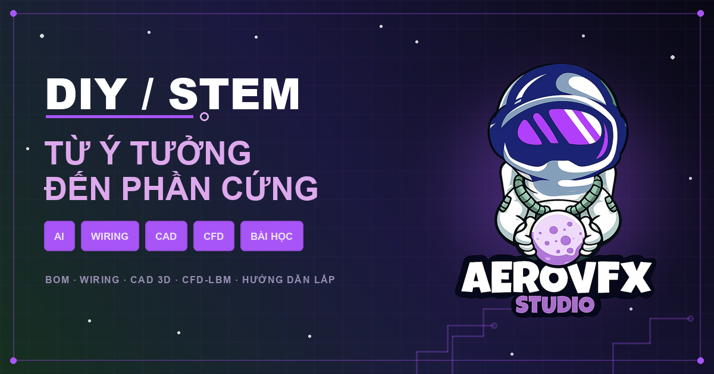

# AeroDIY — Xưởng thiết kế phần cứng cùng AI

<p align="center">
  
</p>

<p align="center">
  Biến một ý tưởng thành <strong>BOM, nguồn mua, wiring, CAD 3D, mô phỏng CFD</strong>
  và hướng dẫn lắp ráp trong cùng một ứng dụng.
</p>

<p align="center">
  <a href="https://aerovfx.github.io/AeroDIY/"><strong>🚀 Mở AeroDIY</strong></a>
  &nbsp;·&nbsp;
  <a href="https://aerovfx.github.io/AeroDIY/gpu-lab/"><strong>🧪 Mở GPU Lab</strong></a>
  &nbsp;·&nbsp;
  <a href="https://github.com/aerovfx/AeroDIY"><strong>GitHub</strong></a>
</p>

> Bản public được tự động build và triển khai bằng GitHub Actions từ nhánh `main`.

## Bắt đầu nhanh

Yêu cầu: **Node.js 22.13 trở lên**.

```bash
cd diy-app
npm install
npm run dev
```

Sau đó truy cập:

- [Trang chủ AeroDIY](http://localhost:3000/)
- [WebGPU / CFD Lab](http://localhost:3000/gpu-lab)
- [Trang debug local](http://localhost:3000/__debug)

## Mọi thứ có trên trang chủ

Trang chủ là điểm bắt đầu cho toàn bộ quy trình DIY:

| Khu vực | Bạn có thể làm gì? | Truy cập |
|---|---|---|
| **AI Design** | Mô tả thứ muốn chế tạo, chọn ngân sách và ưu tiên thiết kế | [Mở ứng dụng](http://localhost:3000/) |
| **Project Templates** | Chọn trong 34 mẫu UAV, USV, robot, máy in 3D, wearable và smart home | [Mở ứng dụng](http://localhost:3000/) |
| **BOM & Purchasing** | Xem linh kiện, giá dự toán, nguồn mua và trạng thái đặt hàng | Trang **PARTS / PURCHASING** trong workbench |
| **Wiring** | Xem sơ đồ nguồn, tín hiệu, pinout và kết nối giữa các linh kiện | Trang **WIRING** trong workbench |
| **CAD 3D** | Xoay, phóng to, exploded view và xuất FCStd, STEP, STL | Trang **MECH** trong workbench |
| **CFD 2D/3D** | Kiểm tra khí động/thủy động bằng LBM và WebGPU | Trang **CFD** hoặc [GPU Lab](http://localhost:3000/gpu-lab) |
| **Build Guide** | Theo dõi dụng cụ, vật tư và từng bước lắp ráp | Trang **INSTRUCTIONS** trong workbench |
| **Project Export** | Đóng gói cấu hình, BOM, wiring, CAD và tài liệu thành ZIP | Nút **DOWNLOAD** trong workbench |

## Các nhóm dự án

- **UAV:** mini quadcopter, FPV racer, filming drone, long-range fixed-wing,
  VTOL survey, delivery drone, mother UAV và ornithopter.
- **Robotics:** mobile robot, companion bot, Wall‑E, quadruped robodog,
  humanoid và SCARA arm.
- **Marine:** autonomous USV, RC boat và mini submarine ROV.
- **Workshop:** máy in 3D, CNC mill, large-format printer và cyber multitool.
- **Energy & IoT:** smart home, tưới vườn, wind harvester và biodiesel reactor.
- **Wearable & mobility:** AR glasses, lift boot, exosuit và electric motorcycle.

## Kiến trúc và mã nguồn

| Thành phần | Link |
|---|---|
| Ứng dụng web | [`diy-app/app`](diy-app/app) |
| Trang chủ và workbench | [`diy-app/app/page.tsx`](diy-app/app/page.tsx) |
| Design system | [`diy-app/app/globals.css`](diy-app/app/globals.css) |
| CAD engine | [`diy-app/lib/cad-engine.ts`](diy-app/lib/cad-engine.ts) |
| CFD-LITE | [`diy-app/lib/cfd-engine.ts`](diy-app/lib/cfd-engine.ts) |
| CFD-LBM 2D | [`diy-app/lib/cfd-lbm.ts`](diy-app/lib/cfd-lbm.ts) |
| CFD-LBM 3D / WebGPU | [`diy-app/lib/cfd-lbm3d-gpu.ts`](diy-app/lib/cfd-lbm3d-gpu.ts) |
| MCP CAD server | [`diy-app/mcp-server`](diy-app/mcp-server) |
| FreeCAD runtime | [`diy-app/cad-runtime`](diy-app/cad-runtime) |
| Tài liệu kiến trúc | [`diy-app/docs/ARCHITECTURE.md`](diy-app/docs/ARCHITECTURE.md) |
| README kỹ thuật CAD/CFD | [`diy-app/README.md`](diy-app/README.md) |

## Kiểm tra dự án

```bash
cd diy-app
npm run build
npm run lint
npm test
```

## Công nghệ

Next.js 16 · React 19 · TypeScript · Three.js · WebGL2/WebGPU · Cloudflare
Workers · D1/Drizzle · FreeCAD/OpenCascade · Model Context Protocol.

---

<p align="center">
  <strong>AeroDIY</strong> — nghĩ lớn, mô phỏng trước, chế tạo an toàn.
</p>
